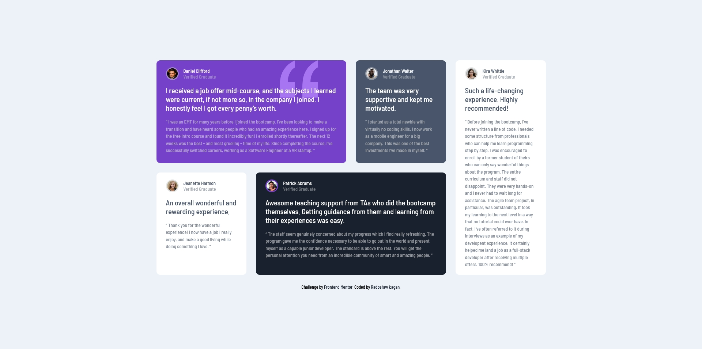

# Frontend Mentor - Testimonials grid section | solution

This is a solution to the [Testimonials grid section challenge on Frontend Mentor](https://www.frontendmentor.io/challenges/testimonials-grid-section-Nnw6J7Un7). Frontend Mentor challenges help you improve your coding skills by building realistic projects.

## Overview

### The challenge

Users should be able to:

- View the optimal layout for the site depending on their device's screen size

### Screenshot

### Links

- Live Site URL: [HERE](https://your-live-site-url.com)

## My process

### Built with

- HTML5
- SASS (SCSS)
- BEM
- Flexbox
- CSS Grid
- Mobile-first workflow
